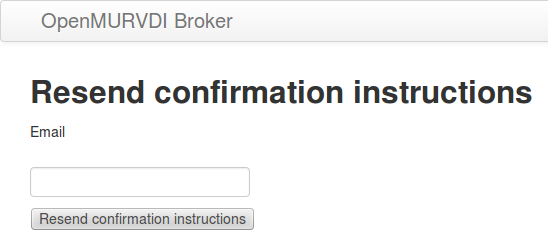
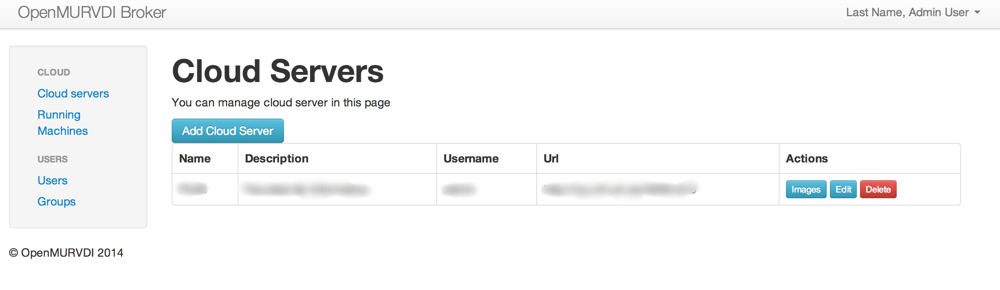

# Broker. Instalación y Manual

## Descripción

El broker vdi es la aplicación web que conecta el servidor Openstack en el funcionan las instancias de la maquinas virtuales con el usuario.
Se basa principalmente en el framework de programación web Ruby on Rails aunque utiliza otras tecnologías como bases de datos SQL y NoSQL, javascript y java. 

A través del broker se pueden gestionar usuarios, grupos o roles, máquinas virtuales, plantillas y conexiones a diversos clouds openstack. La idea es que el administrador del broker creará conexiones con diferentes clouds, en los que usando las imágenes albergados en ellos, creará plantillas a disposición de los usuarios del broker. Estos últimos podrán arrancar esas máquinas virtuales y conectarse a ellas de forma transparente a traves de nuestra aplicación. El control de acceso a esas imágenes se controla a traves de la asignación de grupos a las imagenes disponibles y usuarios.

El usuario tiene la posibilidad de darse de alta y autenticarse en la aplicacion web e interactuar con ella a través de un navegador.

## Requisitos

Para montar un escenario en el que se pueda utilizar el broker se necesita un servidor linux donde se instalará el broker y un servidor Openstack accesible.


## Instalación y configuración

Aquí se expone como instalar el broker en un servidor Ubuntu 14.04, pero las instrucciones son extrapolables a cualquier otra distribución

En el servidor necesitamos tener un usuario llamado openvdi con permisos de sudo. De no tenerlo, como root, tecleamos:

```
adduser openvdi
adduser openvdi adm
adduser openvdi sudo
```

Despues de esto, creamos la confianza ssh con la maquina para poder conectarnos sin clave con el usuario openvdi. A partir de aquí, nos conectamos por ssh con usuario openvdi y  todos los comandos los teclearemos como usuario openvdi.

Necesitamos tener Ruby 2.0 instalado. Lo instalamos a través de la herramienta rvm.

```
\curl -sSL https://get.rvm.io | bash -s stable
source /home/openvdi/.rvm/scripts/rvm
rvm install 2.0
```

Y obtenemos una salida parecida a esta

```
openvdi@pp:~$ rvm install 2.0
Searching for binary rubies, this might take some time.
No binary rubies available for: ubuntu/14.04/x86_64/ruby-2.0.0-p481.
Continuing with compilation. Please read 'rvm help mount' to get more information on binary rubies.
Checking requirements for ubuntu.
Installing requirements for ubuntu.
openvdi password required for 'apt-get --quiet --yes update':
....
Installing required packages: g++, gcc, make, libc6-dev, libreadline6-dev, zlib1g-dev, libssl-dev, libyaml-dev, libsqlite3-dev, sqlite3, autoconf, libgdbm-dev, libncurses5-dev, automake, libtool, bison, pkg-config, libffi-dev............................
Requirements installation successful.
Installing Ruby from source to: /home/openvdi/.rvm/rubies/ruby-2.0.0-p481, this may take a while depending on your cpu(s)...
ruby-2.0.0-p481 - #downloading ruby-2.0.0-p481, this may take a while depending on your connection...
  % Total    % Received % Xferd  Average Speed   Time    Time     Time  Current
                                 Dload  Upload   Total   Spent    Left  Speed
100 10.2M  100 10.2M    0     0  3185k      0  0:00:03  0:00:03 --:--:-- 3186k
ruby-2.0.0-p481 - #extracting ruby-2.0.0-p481 to /home/openvdi/.rvm/src/ruby-2.0.0-p481...
ruby-2.0.0-p481 - #configuring.................................................
ruby-2.0.0-p481 - #post-configuration.
ruby-2.0.0-p481 - #compiling..............................................................................
ruby-2.0.0-p481 - #installing.............................
ruby-2.0.0-p481 - #making binaries executable..
ruby-2.0.0-p481 - #downloading rubygems-2.2.2
  % Total    % Received % Xferd  Average Speed   Time    Time     Time  Current
                                 Dload  Upload   Total   Spent    Left  Speed
100  404k  100  404k    0     0   483k      0 --:--:-- --:--:-- --:--:--  483k
No checksum for downloaded archive, recording checksum in user configuration.
ruby-2.0.0-p481 - #extracting rubygems-2.2.2...
ruby-2.0.0-p481 - #removing old rubygems.........
ruby-2.0.0-p481 - #installing rubygems-2.2.2...............
ruby-2.0.0-p481 - #gemset created /home/openvdi/.rvm/gems/ruby-2.0.0-p481@global
ruby-2.0.0-p481 - #importing gemset /home/openvdi/.rvm/gemsets/global.gems.............................................................
ruby-2.0.0-p481 - #generating global wrappers.........
ruby-2.0.0-p481 - #gemset created /home/openvdi/.rvm/gems/ruby-2.0.0-p481
ruby-2.0.0-p481 - #importing gemsetfile /home/openvdi/.rvm/gemsets/default.gems evaluated to empty gem list
ruby-2.0.0-p481 - #generating default wrappers.........
ruby-2.0.0-p481 - #adjusting #shebangs for (gem irb erb ri rdoc testrb rake).
Install of ruby-2.0.0-p481 - #complete
Ruby was built without documentation, to build it run: rvm docs generate-ri
``` 

Para comprobar que tenemos ruby 2.0 funcionando, basta con escribir en la consola `ruby -v` y obtendremos una salida asi: `ruby 2.0.0p481 (2014-05-08 revision 45883) [x86_64-linux]`. 
Procedemos con la instalación de diversos servicios necesarios para el broker con el comando `sudo apt-get install mysql-client-5.5 mysql-server nginx-full redis-server git libmysqlclient-dev postfix git imagemagick`. 

Una vez instalados los servicios, procedemos a la creación de la base de datos de producción

```
mysql -u root -p
create database openvdi_production;
exit
```

Editamos .gitconfig para evitar que se chequee el certificado del servidor.

`vi ~/.gitconfig`

```
[http]
    sslVerify = false
```

Creamos los directorios donde alojaremos el broker `sudo mkdir -p /var/www/openvdi/ -p; `, clonamos el repositorio con `cd /var/www/ ; sudo chown openvdi.openvdi openvdi/ ; cd openvdi; git clone https://github.com/OpenMurVDI/broker.git`  y editamos la conexión a la base de datos asi: `sudo vi /var/www/openvdi/broker/config/database.yml`. El contenido será algo como que asi

```
production:
  adapter: mysql2
  database: openvdi_production
  username: root
  password: 
```

Tambiém creamos el directorio para albergar el applet, `sudo mkdir -p /var/www/openvdi/broker/public/applet` y copiamos el applet a ese directorio.

y lo dejamos todo con los permisos adecuados para que nuestro usuario sea el propietario `sudo  chown openvdi.openvdi /var/www/openvdi/ -R`

Creamos el fichero de configuración ngnix: `sudo vi /etc/nginx/sites-available/openvdi.conf` con este contenido:

```
upstream openvdi {
  server unix:///tmp/openvdi.sock;
}

server {
  listen 80;
  server_name iescierva.net; # change to match your URL
  root /var/www/openvdi/broker/public; # I assume your app is located at this location

  location / {
    proxy_pass http://openvdi; # match the name of upstream directive which is defined above
    proxy_set_header Host $host;
    proxy_set_header X-Forwarded-For $proxy_add_x_forwarded_for;
  }

  location /applet {
    root /var/www/openvdi/broker/public;
  }

  location ~* ^/(system|assets)/ {
    # Per RFC2616 - 1 year maximum expiry
    expires 1y;
    add_header Cache-Control public;

    # Some browsers still send conditional-GET requests if there's a
    # Last-Modified header or an ETag header even if they haven't
    # reached the expiry date sent in the Expires header.
    add_header Last-Modified "";
    add_header ETag "";
    break;
  }
}

```

y configuramos el servidor web

```
  cd /etc/nginx/sites-enabled
  sudo ln -s /etc/nginx/sites-available/openvdi.conf
  sudo rm -f default
  sudo /etc/init.d/nginx restart
```
    
Despues, creamos el servicio para manejar la aplicación con `sudo vi /etc/init.d/openvdi` con el contenido

```
#!/bin/bash

# OpenVDI
# Maintainer: raul@um.es

### BEGIN INIT INFO
# Provides:          openvdi
# Required-Start:    $local_fs $remote_fs $network $syslog redis-server
# Required-Stop:     $local_fs $remote_fs $network $syslog
# Default-Start:     2 3 4 5
# Default-Stop:      0 1 6
# Short-Description: OpenVDI management
# Description:       OpenVDI management
### END INIT INFO


APP_ROOT="/var/www/openvdi/broker"
PID_PATH="$APP_ROOT/tmp/pids"
WEB_SERVER_PID="$PID_PATH/puma.pid"
DAEMON_OPTS="-C $APP_ROOT/config/puma.rb -e production --pidfile $WEB_SERVER_PID"
SIDEKIQ_PID="$PID_PATH/sidekiq.pid"
START_SIDEKIQ="RAILS_ENV=production bundle exec sidekiq -d -L $APP_ROOT/log/sidekiq.log -P $SIDEKIQ_PID "
NAME="openvdi"
DESC="OpenVDI"

check_pid(){
 echo $WEB_SERVER_PID
  if [ -f $WEB_SERVER_PID ]; then
    PID=`cat $WEB_SERVER_PID`
    SPID=`cat $SIDEKIQ_PID`
    STATUS=`ps aux | grep $PID | grep -v grep | wc -l`
  else
    STATUS=0
    PID=0
  fi
}

start() {
  cd $APP_ROOT
  check_pid
  if [ "$PID" -ne 0 -a "$STATUS" -ne 0 ]; then
    # Program is running, exit with error code 1.
    echo "Error! $DESC $NAME is currently running!"
    exit 1
  else
    if [ `whoami` = root ]; then
      sudo -u openvdi -H bash -l -c "mkdir -p $PID_PATH && RAILS_ENV=production bundle exec puma $DAEMON_OPTS"
      sudo -u openvdi -H bash -l -c "mkdir -p $PID_PATH && $START_SIDEKIQ "
# > /dev/null  2>&1 &"
      echo "$DESC started"
    fi
  fi
}

stop() {
  cd $APP_ROOT
  check_pid
    ## Program is running, stop it.
    kill -QUIT `cat $WEB_SERVER_PID`
    kill -QUIT `cat $SIDEKIQ_PID`
    rm "$WEB_SERVER_PID" >/dev/null  2>/dev/null
    killall ruby >/dev/null 2> /dev/null
    rm "$SIDEKIQ_PID" >/dev/null  2>/dev/null
    echo "$DESC stopped"
}

restart() {
  cd $APP_ROOT
  check_pid
    echo "Restarting $DESC..."
    stop
    start

    echo "$DESC restarted."
}

status() {
  cd $APP_ROOT
  check_pid
  if [ "$PID" -ne 0 -a "$STATUS" -ne 0 ]; then
    echo "$DESC / PUMA with PID $PID is running."
    echo "$DESC / Sidekiq with PID $SPID is running."
  else
    echo "$DESC is not running."
    exit 1
  fi
}

## Check to see if we are running as root first.
if [ "$(id -u)" != "0" ]; then
    echo "This script must be run as root"
    exit 1
fi

case "$1" in
  start)
        start
        ;;
  stop)
        stop
        ;;
  restart)
        restart
        ;;
  reload|force-reload)
        echo -n "Reloading $NAME configuration: "
        kill -HUP `cat $PID`
        echo "done."
        ;;
  status)
        status
        ;;
  *)
        echo "Usage: sudo service openvdi {start|stop|restart|reload}" >&2
        exit 1
        ;;
esac

exit 0

```

y lo añadimos al sudo del usuario openvdi. Tecleamos `sudo visudo` y dejamos el fichero asi

```
#
# This file MUST be edited with the 'visudo' command as root.
#
# Please consider adding local content in /etc/sudoers.d/ instead of
# directly modifying this file.
#
# See the man page for details on how to write a sudoers file.
#
Defaults  env_reset
Defaults  mail_badpass
Defaults  secure_path="/usr/local/sbin:/usr/local/bin:/usr/sbin:/usr/bin:/sbin:/bin"

Cmnd_Alias OPENVDI=/etc/init.d/openvdi

# Host alias specification

# User alias specification

# Cmnd alias specification

# User privilege specification
root  ALL=(ALL:ALL) ALL

# Members of the admin group may gain root privileges
%admin ALL=(ALL) ALL

# Allow members of group sudo to execute any command
%sudo ALL=(ALL:ALL) ALL

# See sudoers(5) for more information on "#include" directives:

openvdi ALL=NOPASSWD:OPENVDI

#includedir /etc/sudoers.d

```


Por último, añadimos el arranque automático del servicio:

```
cd /etc/rc2.d/
sudo ln -s /etc/init.d/openvdi S99openvdi
sudo chmod  +x /etc/init.d/openvdi
/etc/init.d/openvdi start
```

Sitúate de nuevo en el directorio de la aplicación `cd /var/www/openvdi/broker`
Teclea `bundle install; RAILS_ENV=production bundle exec rake assets:precompile; RAILS_ENV=production bundle exec rake db:migrate` para hacer la instalación de las gemas y la migración de la base de datos y si quieres crear los usuarios por defecto, `RAILS_ENV=production bundle exec rake db:seed`.

Y reiniciamos de nuevo nginx y openvdi
````
sudo /etc/init.d/openvdi restart
sudo /etc/init.d/nginx restart
````

Los usuarios seran
```
admin@openvdi.com, con clave changeme
user@openvdi.com, con clave changeme
```

Editaremos nuestro crontab con `crontab -e` y dejaremos la línea parecida a esto. Sólo tendremos que cambiar el directrio donde hacemos el cd. 

````
0 * * * * /bin/bash -l -c 'cd /var/www/openvdi/broker && bundle exec rails runner Machine.check_expired -e production 2> /dev/null'
```

## Pasos para configurar OpenVDI en el cliente

Comprueba [aquí](http://www.java.com/es/download/installed.jsp) que tienes correctamente instalado Java en tu navegador. Una vez hecho esto, añada la dirección http://www.openvdi.com (o el correspondiente donde este instalada) como sitio de confianza en el panel de control de Java. Pestaña Seguridad->Editar lista de sitios.

Si utiliza un cliente Linux, instale la aplicación freerdp-x11 (sudo apt-get install freerdp-x11).
Si utiliza Mac Os X, instale la aplicación [CoRD](http://sourceforge.net/projects/cord/files/cord/0.5.7/CoRD_0.5.7.zip/download) en su carpeta de aplicaciones.

## Manual de usuario

  


### REGISTRO INICIAL

Antes de poder iniciar sesión en el broker OpenMURVDI es necesario registrarse. Para ello, seleccionamos la opción *Sign up* de la pantalla de inicio de sesión.


Para completar el proceso de registro es necesario facilitar un nombre y apellidos, un correo electrónico y una contraseña de acceso.


También existen opciones para recuperar la contraseña olvidada (Forgot your password?), reenviar las instrucciones de confirmación (Didn't receive confirmation instructions?) o reenviar las instrucciones de desbloqueo (Didn't receive unlock instructions?). En todos estos casos, será necesario facilitar un correo electrónico para recibir la información solicitada.





Una vez completados los datos de registro, recibiremos un correo en la dirección facilitada desde donde podremos confirmar el registro.

### INICIO DE SESIÓN
En la pantalla de inicio de sesión del broker OpenMURVDI deberemos escribir el correo y la contraseña que indicamos durante el proceso de registro. 
Opcionalmente, podremos marcar la casilla *Remember me* lo que nos evitará tener que estar escribiendo la dirección de correo cada vez que queramos iniciar una sesión en el broker desde ese mismo navegador.


### ¿CÓMO LANZAR UNA INSTANCIA DE OPENSTACK?

Después de iniciar sesión, nos aparecerá una pantalla de bienvenida en donde podremos ver las máquinas que tenemos funcionando en ese momento y las imágenes disponibles para lanzar nuevas instancias.


Para lanzar una instancia, tan sólo tendremos que seleccionar la opción *Launch* de la imagen del SO que queremos lanzar (en la imagen anterior únicamente tendríamos disponible una imagen de Ubuntu Desktop 12.04).


En ese momento se abrirá una nueva pantalla indicándonos que la máquina ha sido creada con éxito (*Machine was successfully created*), así como información necesaria para conectarnos a la misma:
Usuario (por defecto, *openvdi*).
Contraseña (generada de forma aleatoria).
Dirección IP.


Sin embargo, como es probable que queramos iniciar una sesión gráfica, también se especifican una serie de requisitos que tiene que cumplir nuestro sistema para ello. Fundamentalemente, un cliente de escritorio remoto adecuado y el plugin de Java para el navegador que estemos empleando.

### CONECTARNOS GRÁFICAMENTE A UNA INSTANCIA

Si nuestro sistema cumple los requisitos necesarios, tendremos que activar el plugin del navegador pulsando sobre el recuadro gris que se muestra en la pantalla.


Si no tenemos instalados en nuestro navegador los certificados correspondientes, es posible que nos aparezca una mensaje de advertencia informándonos de ello. Para continuar con el proceso seleccionamos la opción *Run* y aceptamos la conexión remota.


La conexión se iniciará inmediatamente.


### Administración 
Para acceder a estas opciones, tendrás que iniciar sesión como administrador.

### Gestión de usuarios

Existen dos formas de darse de alta en la aplicación:

#### Forma individual

  Si un usuario quiere darse de alta, tendra que pinchar en el enlace "Sign Up" de la página de inicio. Una vez alli, dar su nombre, apellidos, dirección de correo electrónico y clave.
  Una vez hecho esto, recibirá un correo en la dirección indicada donde tendrá que confirmar que el la dirección de correo aportada es correcta. Una vez confirmada la dirección, uno de los administradores tendra que aprobar la cuenta. El grupo al que pertenecerá el usario por defecto es "default".
  A partir de ese momento, el usuario podrá hacer uso de la aplicación.

#### Forma masiva a través de fichero csv

  En el caso de tener que dar de alta un número grande de usuarios se podrá hacer a través de un fichero .csv con los campos correspondientes. 
  El procedimiento, será acceder a la aplicación como administrador, pinchar sobre el enlace "Users" y luego sobre el botón "Create users from CSV file".

  
  
  Un ejemplo de fichero csv correcto sería el siguiente:

  
  	"correo1@openvdi.com","Apellido1 Apellido1","Nombre1","role1"
  	"correo2@openvdi.com","Apellido2 Apellido2","Nombre2",""
  	"correo3@openvdi.com","Apellido3 Apellido3","Nombre3","role1,role2"
  	"correo4@openvdi.com","Apellido4 Apellido4","Nombre4","role1,role2"
  	"correo5@openvdi.com","Apellido5 Apellido5","Nombre5","role1,role2"
  
  
Todos los usuarios seran confirmados y aprobados automáticamente después del procedimiento.

### Gestión de Grupos

 

El administrador de la aplicación puede dar de alta/editar/borrar grupos de usuarios a través del enlace "Groups" del menú. Los usuarios pertenecerán por defecto al grupo "default". Al editar un usuario se podrá determinar a qué grupos pertenece.

Asimismo, al dar de alta un grupo, se asignan dos valores adicionales. 
  1. Machine Lifetime. Tiempo en horas que la máquina vivirá después de crearse. 0 significa que la máquina no caduca.
  2. Machine Idletime. Tiempo en horas que la maquina vivirá despues del ultimo acceso al broker del usuario. 0 significa que la máquina no caduca.

Estos valores se asignan a un grupo. El usuario hereda estos valores de los grupos a los que pertenece. El mayor de esos valores de cada uno de sus grupos será el que se le aplique a las máquinas de los usuarios.
El broker chequea cada hora qué maquinas han caducado y las destruye.

### Gestión de servidores cloud e imágenes

  

  El broker debe de estar conectado a al menos un servidor Openstack. El primer paso para realizar esto es pinchar en el menú "Cloud Server" y añadir uno nuevo. Los parámetros que se necesitan son:
1. Nombre.
2. Descripción. 
3. Username. Usuario de openstack donde van a correr las instancias de las máquinas 
4. Password. Clave del usuario openstack.
5. Url. URL del endpoint de openstack al que conectarnos.


  Una vez definidos las conexiones a servidores cloud, podremos dar visibilidad a las plantillas de máquinas disponibles en el cloud. Esto se hace creando "imágenes" en el botón correspondiente dentro del listado de "Cloud Servers".

  En este apartado, podremos crear/editar/borrar imágenes. Es importante saber, que si se destruye una imagen, tambien se destruirán en cascada todas las máquinas que se estén ejecutando de ella. 
  El listado se muestra de esta forma.
  
  

  La edición de una imagen se muestra así:

  

  Los campos utilizados en la creación de esas imágenes son los siguientes:
1. Nombre.
2. Descripción.
3. Logo. Seleccionaremos un fichero de imagen que será el logo mostrado en los listados.
4. Machine. Plantilla en openstack que se iniciará como máquina para el usuario del broker. Es un desplegable con las plantillas que hay en el servidor cloud.
5. Flavor. Sabor con el que se ejecutará la plantilla. Se definen en OpenStack y aquí aparece un desplegable con los sabores existentes.
6. Number of Instances. Número de instancias que el broker tiene encendidas para dar a los usuarios cuando las necesiten. De esta forma se evita que el usuario tenga que esperar a que la máquina se encienda antes de poder conectarse.
7. Roles. Checkboxes con los grupos que podrán arrancar instancias de esta imagen.


  #### Running Machines

  

  Adicionalmente a las máquinas disponibles por el usuario, el administrador tiene acceso a todas las máquinas creadas por el broker en el enlace "Running Machines". Ahí puede destruirlas/reiniciarlas o conectarse a ellas cuando considere necesario.

## Documentación automática generada por Rails

Se puede encontrar en el directorio doc de la aplicacion
