## CONFIGURACIÓN DE RASPBERRY PI CON *RASPBERRY PI THIN CLIENT*

### ¿Qué es Raspberry Pi Thin Client?
Raspberry Pi Thin Client es un proyecto ocupado en crear distribuciones para Raspberry Pi cuyo objetivo, como ellos mismo reconocen en su página web (<http://rpitc.blogspot.com.es>), es facilitar clientes ligeros (*thin client*) de bajo coste utilizando como hardware una Raspberry Pi, capaz de ejecutar aplicaciones como Microsoft RDC, Citrix ICA, VMWare View, OpenNX & SPICE.
En este proyecto, hemos usado una de sus distribuciones más recientes basada en Debian Jessie, *RPi-TC ARMv6j Release 5*, para configurar un cliente ligero sobre el hardware de una Raspberry Pi capaz de conectarse vía RDP con las máquinas virtuales servidas por nuestra infraestructura de OpenStack a través de un broker VDI.

### Instalación de la imagen de RPi-TC en la tarjeta SD de nuestra Raspberry Pi
Dado que la tarjeta SD empleada servirá de dispositivo de almacenamiento del Sistema Operativo de nuestra Raspberry Pi, conviene utilizar, al menos, una tarjeta SDHC de clase 10 con una capacidad de 16 GB. Asimismo, conviene comprobar la compatibilidad de la misma en la siguiente dirección: <http://elinux.org/RPi_SD_cards>.

El proceso de instalación es el siguiente:

1. Descargamos la imagen que queramos usar desde el siguiente enlace:
<http://rpitc.blogspot.com.es/p/download.html>
2. Formateamos la tarjeta SD en FAT32 (FAT16 no sirve). Por ejemplo, suponiendo que nuestra tarjeta tiene una única partición `/dev/mmcblk0p1`, el comando a ejecutar sería:

		# mkfs.vfat -F 32 /dev/mmcblk0p1

3. Extraemos la imagen del fichero comprimido `.rar` y la copiamos en nuestra tarjeta SD con la ayuda del comando `dd` (Linux/Mac) o con algún programa adecuado (p. ej.: *Win32DiskImager* si usamos Windows).

		# dd bs=4M if=imagen-RPi-TC.img of=/dev/mmcblk0

4. Una vez copiada la imagen, extraemos la tarjeta SD de nuestro lector de tarjetas y la introducimos en la Raspberry Pi.

### Configuración básica inicial
#### a) Actualización de los repositorios y del software instalado
El primer paso será actualizar los repositorios y el software instalado en el sistema:

	# apt-get update
	# apt-get upgrade
	# apt-get dist-upgrade

Sin embargo, a veces al actualizar paquetes en distribuciones basadas en Debian (como RPi-TC) con el comando `apt-get upgrade` podemos recibir el mensaje: *“The following packages have been kept back”* seguido del nombre del paquete o paquetes que no se van a actualizar a pesar de haberse encontrado una nueva versión.
Esto, según parece, es debido a que `apt-get` no es capaz de resolver ciertas dependencias implicadas en la actualización dicho paquete o paquetes, dependencias que estarían relacionadas con componentes que afectan directamente al funcionamiento del sistema.
Una posible solución a este problema es usar `aptitude` en lugar de `apt-get` para realizar la actualización, ya que `aptitude` parece resolver mejor este tipo de dependencias y actualizaciones.
Para ello, ejecutaríamos los siguientes comandos:

    # apt-get install aptitude
    # aptitude install safe-upgrade
    # aptitude install dist-upgrade

#### b) Expansión el sistema de ficheros
Por defecto, durante la instalación de RPi-TC se crean dos particiones en nuestra tarjeta SD: una partición de arranque de algo menos de 64 MB en formato FAT32, y una partición raíz que contiene el sistema operativo de 1,5 GB.
Sin embargo, con este esquema de particionado no aprovechamos completamente la capacidad de la tarjeta SD que estemos empleando, por lo que resulta muy conveniente redimensionar el tamaño  de la partición raíz para aprovechar plenamente el espacio disponible. Para ello, tenemos que seguir los siguientes pasos:

1. Hacemos una copia de seguridad de los datos de nuestra tarjeta SD. Por ejemplo, en Linux y suponiendo que nuestro sistema la detecta como el dispositivo `/dev/mmcblk0`, podríamos hacer lo siguiente:

		# dd bs=4M if=/dev/mmcblk0 of=copia-seguridad-sd.img

2. Insertamos nuevamente la tarjeta en la Raspberry PI y comprobamos que, efectivamente, la distribución de las particiones no ocupa todo el espacio disponible en la tarjeta SD con el comando `df -h`:

		rpitc@rpitc-b5066a9f:~$ df -h
		Filesystem      Size  Used Avail Use% Mounted on
		/dev/root       1.5G  934M  453M  68% /
		tmpfs            45M  164K   44M   1% /run
		tmpfs           5.0M     0  5.0M   0% /run/lock
		devtmpfs         10M     0   10M   0% /dev
		tmpfs           221M  8.0K  221M   1% /tmp
		tmpfs           221M   20K  221M   1% /var/log
		/dev/mmcblk0p1   64M   17M   47M  27% /boot
		tmpfs            89M     0   89M   0% /run/shm

3. Ejecutamos el comando `fdisk -l` para comprobar el nombre del dispositivo y de la partición que queremos redimensionar:

		rpitc@rpitc-b5066a9f:~$ sudo fdisk -l
		[sudo] password for rpitc:
		Disk /dev/mmcblk0: 15.9 GB, 15931539456 bytes
		4 heads, 16 sectors/track, 486192 cylinders, total 31116288 sectors
		Units = sectors of 1 * 512 = 512 bytes
		Sector size (logical/physical): 512 bytes / 512 bytes
		I/O size (minimum/optimal): 512 bytes / 512 bytes
		Disk identifier: 0x000cd8bd
	        Device Boot      Start         End      Blocks   Id  System
		/dev/mmcblk0p1            8192      139263       65536    6  FAT16
		/dev/mmcblk0p2          139264     3211263     1536000   83  Linux

	Aquí vemos que el dispositivo es `/dev/mmcblk0` y la partición es `/dev/mmcblk0p2`.

4. Modificamos la tabla de particiones del dispositivo con `fdisk` (no es necesario desmontar las particiones) siguiendo los siguientes pasos:

	a) Ejecutamos `fdisk` pasándole como parámetro el dispositivo:
		`rpitc@rpitc-b5066a9f:~$ sudo fdisk /dev/mmcblk0 `
	
	b) Borramos la partición que contiene el sistema operativo, en nuestro caso la segunda partición, con la secuencia de opciones `d`y `2`:

		Command (m for help): d
		Partition number (1-4): 2

	c) Creamos una nueva partición 2 que comience en el mismo punto que la partición que acabamos de borrar (en nuestro ejemplo 139264). Para ello, hacemos lo siguiente:
	
		Command (m for help): n			# Creamos una nueva partición
		Partition type:
	  	 p   primary (1 primary, 0 extended, 3 free)
	   	e   extended
		Select (default p): p				# Indicamos que sea primaria
		Partition number (1-4, default 2): 2	# Será la segunda partición
		First sector (2048-31116287, default 2048): 139264	# Valor de inicio
		Last sector, +sectors or +size{K,M,G} (139264-31116287, default 31116287): # 	Valor final por defecto
		Using default value 31116287
	
	d) Salimos guardando los cambios con la opción `w`:
	
		Command (m for help): w
		The partition table has been altered!
		Calling ioctl() to re-read partition table.
		WARNING: Re-reading the partition table failed with error 16: Dispositivo o 	recurso ocupado.
		The kernel still uses the old table. The new table will be used at
		the next reboot or after you run partprobe(8) or kpartx(8)
		Syncing disks.
	
	e) En este punto, nos informará de que la tabla de particiones ha sido modificada, pero nos mostrará una advertencia de error ya que no habrá podido efectuar los cambios ya que el dispositivo está montado y que estos se aplicarán durante el siguiente reinicio. Por tanto, reiniciamos la máquina:
	
		rpitc@rpitc-b5066a9f:~$ sudo reboot

	f) Sin embargo, hasta ahora tan sólo hemos ampliado el tamaño de la partición, pero no del sistema de ficheros que contiene. Para ello es necesario usar el comando `resize2fs` pasándole como parámetro el nombre de la partición cuyo sistema de ficheros queremos expandir.
	
		rpitc@rpitc-b5066a9f:~$ sudo resize2fs /dev/mmcblk0p2
		[sudo] password for rpitc:
		resize2fs 1.42.8 (20-Jun-2013)
		Filesystem at /dev/mmcblk0p2 is mounted on /; on-line resizing required
		old_desc_blocks = 1, new_desc_blocks = 1
		The filesystem on /dev/mmcblk0p2 is now 3872128 blocks long.
	
	g) Reiniciamos nuestra Raspberry Pi para que los cambios se hagan efectivos, pudiendo comprobarlo con el comando `df -h`:

		rpitc@rpitc-b5066a9f:~$ df -h
		Filesystem      Size  Used Avail Use% Mounted on
		/dev/root        15G  935M   14G   7% /
		tmpfs            45M  164K   44M   1% /run
		tmpfs           5.0M     0  5.0M   0% /run/lock
		devtmpfs         10M     0   10M   0% /dev
		tmpfs           221M  8.0K  221M   1% /tmp
		tmpfs           221M   20K  221M   1% /var/log
		/dev/mmcblk0p1   64M   17M   47M  27% /boot
		tmpfs            89M     0   89M   0% /run/shm

#### c) Configuración de los parámetros regionales y de idioma del sistema:
Para ajustar estos valores podemos ejecutar el comando `dpkg-reconfigure locales` con permisos de administrador:

	rpitc@rpitc-b5066a9f:~$ sudo dpkg-reconfigure locales

Este comando nos abre un menú en modo texto en donde podemos seleccionar los parámetros regionales que queremos instalar en el sistema.

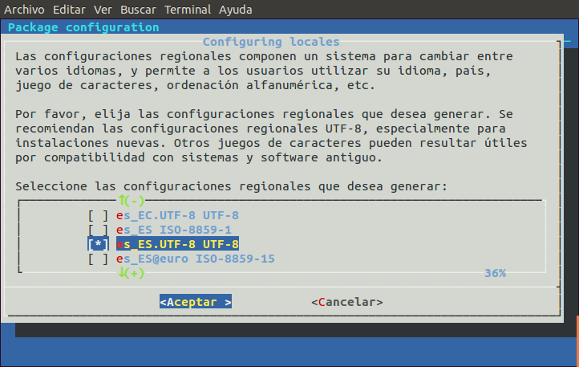

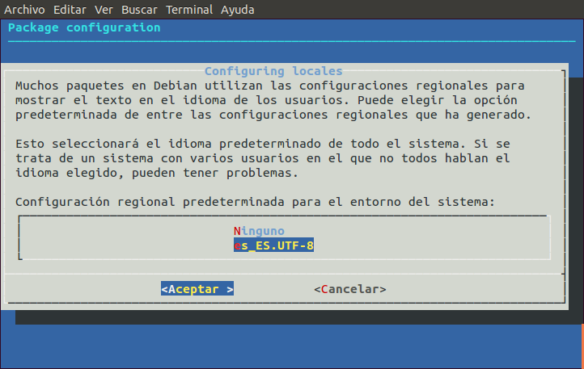

#### d) Configuración del teclado en español
Para la configuración del teclado, el proceso es similar al anterior, pero utilizando el siguiente comando:

	rpitc@rpitc-b5066a9f:~$ sudo dpkg-reconfigure keyboard-configuration

Nuevamente se abrirá un menú en modo texto en donde intentaremos fijar los valores que mejor se ajusten al teclado que estemos empleando.

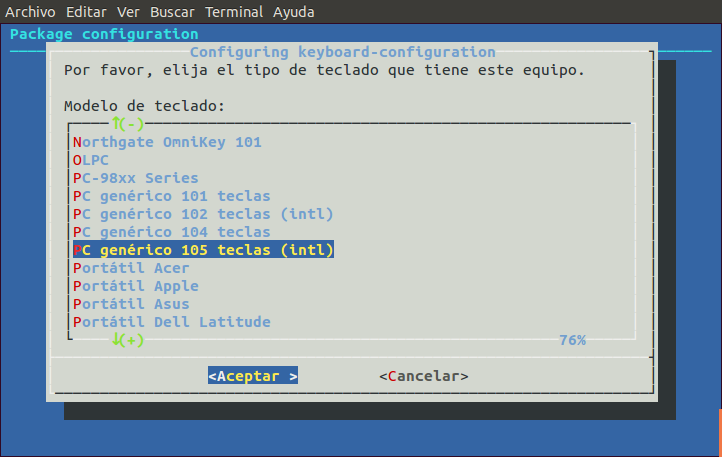

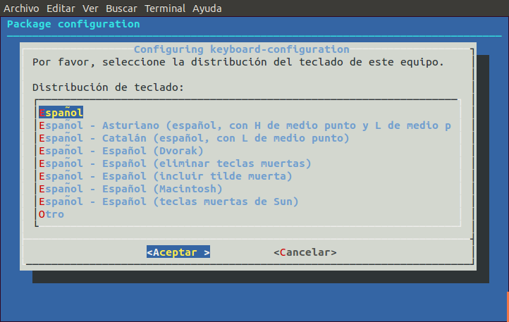

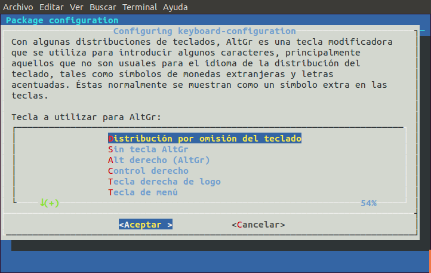

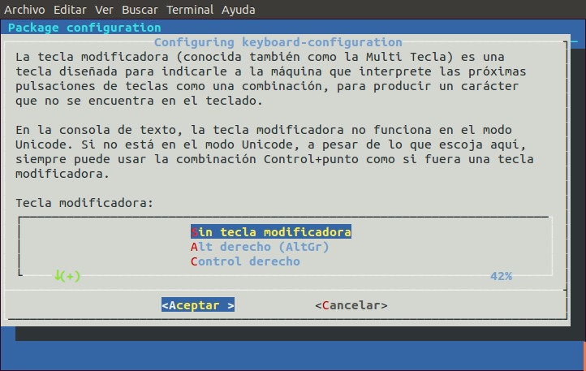

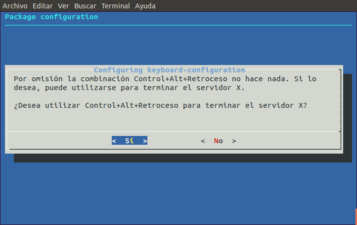

#### e) Configuración de la zona horaria
Para configurara la zona horaria ejecutaremos el siguiente comando que nos abrirá un nuevo menú de texto:
`rpitc@rpitc-b5066a9f:~$ sudo dpkg-reconfigure tzdata`

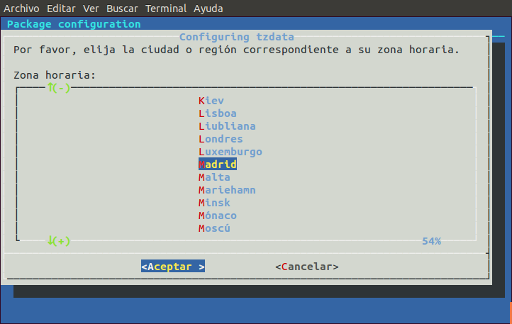

#### f) Overclocking
Aunque la Raspberry Pi no tiene BIOS, sí tiene otras formas de configurar las características del hardware como, por ejemplo, la frecuencia de reloj. De hecho, podemos subir la frecuencia de la CPU de la Raspberry Pi sin perder la garantía desde los 700 MHz en los que viene configurada por defecto hasta 1GHz.
Para ello, en ausencia de la herramienta de configuración `raspi-config` que sí traen otras distribuciones (como, por ejemplo, Raspbian), podemos configurar este parámetro editando manualmente el fichero `/boot/config.txt`. Concretamente la línea que tendríamos que descomentar y modificar sería ésta:

	#uncomment to overclock the arm. 700 MHz is the default.
	#arm_freq=900

Por ejemplo, podemos configurarlo a 1000 MHz (1GHz), que es la frecuencia máxima recomendada por el fabricante para no perder la garantía, haciendo lo siguiente:

	#uncomment to overclock the arm. 700 MHz is the default.
	arm_freq=1000

Para hacer los cambios efectivos, es necesario reiniciar la máquina.

Podemos hacer una pequeña prueba para saber si el *overclocking* está funcionando y si, efectivamente, estamos obteniendo alguna mejora de rendimiento.
Para ello le vamos a pedir a nuestra Raspberry Pi que ejecute alguna operación matemática que requiere de una alta capacidad de procesamiento con la ayuda del comando `bc` (`# apt-get install bc`). Concretamente el comando que vamos a utilizar sería éste:

	time echo "scale=2500;4*a(1)" | bc -l

Con este comando estamos efectuando un cálculo del número Pi con 2500 posiciones decimales usando la función arcotangente incluida en el comando `bc`, y obteniendo el tiempo de ejecución de la misma gracias al comando `time`. La opción `-l` del comando `bc` simplemente hace que se tengan en cuentan las librerías necesarias.
Tras varios intentos, los mejores resultados obtenidos a una frecuencia de 700 MHz han sido éstos:

	rpitc@rpitc-b5066a9f:~$ time echo "scale=2500;4*a(1)" | bc -l
	3.141592653589793238462643383279...
	...
	...
	real	0m44.082s
	user	0m42.920s
	sys	0m0.120s

Mientras que los mejores datos los hemos obtenido con una frecuencia de 900 MHz:

	rpitc@rpitc-b5066a9f:~$ time echo "scale=2500;4*a(1)" | bc -l
	3.141592653589793238462643383279...
	...
	...
	real	0m43.777s
	user	0m42.770s
	sys	0m0.020s

Como vemos, aunque no es mucho, sí se aprecia una cierta mejora.

En cualquier caso, no se debería asociar siempre una subida de la frecuencia a la que trabaja el procesador con una mejora en el rendimiento. De hecho, con pruebas a 1000 MHz no hemos conseguido bajar de 44 segundos, llegando incluso a superar los 45 en varias ocasiones.

#### g) Otras configuraciones
Además de las configuraciones básicas aquí mencionadas, podemos efectuar otras configuraciones adicionales desde del mismo fichero `/boot/config.txt` relacionadas con la gestión del arranque, la memoria o la configuración de la salida de audio/vídeo.
Se puede encontrar una explicación más detallada de cada uno de los parámetros susceptibles de configuración en la siguiente dirección: <http://elinux.org/RPiconfig>

### Requisitos adicionales de nuestra instalación
Para usar una Raspberry Pi con esta versión de RPi-TC como un cliente ligero capaz de conectarse a nuestros servidores de máquinas virtuales de OpenStack es necesario instalar un *plugin* que proporcione soporte al navegador para ejecutar aplicaciones web Java. Este *plugin* será necesario para ejecutar el applet Java que nos permite conectarnos a las instancias de OpenStack desde el broker VDI.
Para ello, basta con instalar el paquete `icedtea-7-plugin` que ya incluye como dependencia el paquete `openjdk-7-jre`:

	# apt-get install icedtea-7-plugin

Asimismo, aunque la distribución empleada ya cuenta con un navegador como Iceweasel capaz de ejecutar aplicaciones web Java, no deberíamos descartar explorar otras alternativas que a nosotros nos han dado mejor rendimiento como Midori (`# apt-get install midori`).

Finalmente, puesto que nuestra distribución ya incorpora `xfreerdp` como cliente de escritorio remoto, no será necesario instalarlo para permitir las conexiones remotas a las instancias de OpenStack lanzadas desde el broker VDI.
Sin embargo, es posible que `xfreerdp` no funcione correctamente mostrándonos el siguiente error:

	rpitc@rpitc-b5066a9f:~$ sudo xfreerdp
	[sudo] password for rpitc:
	xfreerdp: error while loading shared libraries: libudev.so.0: cannot open 		shared object file: No such file or directory

En principio, podríamos pensar que falta dicha librería, pero al intentar instalarla obtenemos un mensaje informándonos de que ya está en su versión más reciente.

	rpitc@rpitc-b5066a9f:~$ sudo apt-get install libudev0
	Leyendo lista de paquetes... Hecho
	Creando árbol de dependencias
	Leyendo la información de estado... Hecho
	libudev0 is already the newest version.
	0 actualizados, 0 se instalarán, 0 para eliminar y 0 no actualizados.

Nosotros lo hemos solucionado creando un enlace simbólico desde el fichero `libudev.so.1` a `libudev.so.0`:

	rpitc@rpitc-b5066a9f:~$ sudo ln -s /lib/arm-linux-gnueabi/libudev.so.1 /lib/arm-linux-gnueabi/libudev.so.0

## CONFIGURACIÓN DE RASPBERRY PI CON RASPBIAN

### Instalación de la imagen de Raspbian en la tarjeta SD de nuestra Raspberry Pi
Dado que la tarjeta SD empleada servirá de dispositivo de almacenamiento del sistema operativo de nuestra Raspberry Pi, conviene utilizar, al menos, una tarjeta SDHC de clase 10 con una capacidad de 16 GB. Asimismo, conviene comprobar la compatibilidad de la misma en la siguiente dirección: <http://elinux.org/RPi_SD_cards>.

El proceso de instalación es el siguiente:

1. Descargamos la imagen de Raspbian que queramos usar desde el siguiente enlace: <http://www.raspberrypi.org/downloads/>
2. Formateamos la tarjeta SD en FAT32 (FAT16 no funciona). Por ejemplo, suponiendo que nuestra tarjeta tiene una única partición `/dev/mmcblk0p1`, el comando a ejecutar sería:

		# mkfs.vfat -F 32 /dev/mmcblk0p1

3. Extraemos la imagen del fichero comprimido y la copiamos en nuestra tarjeta SD con la ayuda del comando `dd` (Linux/Mac) o con un programa adecuado (p. ej. *Win32DiskImager* si usamos Windows).

		# dd bs=4M if=imagen-raspbian.img of=/dev/mmcblk0

4. Una vez copiada la imagen, extraemos la tarjeta SD de nuestro lector de tarjetas y la introducimos en la Raspberry Pi.

### Configuración básica inicial
#### a) Actualización de los repositorios y del software instalado
El primer paso será actualizar los repositorios y el software instalado en el sistema:

    # apt-get update
    # apt-get upgrade
    # apt-get dist-upgrade

Sin embargo, a veces al actualizar paquetes en distribuciones basadas en Debian (como Raspbian) con el comando `apt-get upgrade` podemos recibir el mensaje: *"The following packages have been kept back"*, seguido del nombre del paquete o paquetes que no se van a actualizar a pesar de haberse encontrado una nueva versión.
Esto, según parece, es debido a que `apt-get` no es capaz de resolver ciertas dependencias implicadas en la actualización del paquete o paquetes que decide no actualizar, dependencias que estarían relacionadas con componentes que afectan directamente al funcionamiento del sistema.
Una solución posible a este tema es usar `aptitude` en lugar de `apt-get` para realizar la actualización, ya que `aptitude` parece resolver mejor este tipo de dependencias y actualizaciones.
Para ello, ejecutaríamos los siguientes comandos:

    # apt-get install aptitude
    # aptitude install safe-upgrade
    # aptitude install dist-upgrade

#### b) Uso del comando `raspi-config`
En Raspbian el comando `raspi-config` nos permite acceder a un menú de configuración de nuestra instalación en donde podremos configurar algunos aspectos básicos de la misma.

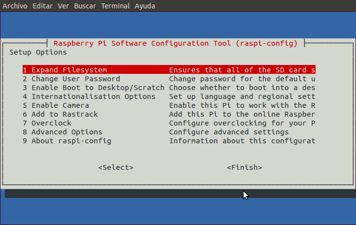

**a) Expandir el sistema de ficheros para que utilice todo el espacio disponible en la tarjeta SD**
Por defecto, al copiar Raspbian en una tarjeta SD a partir de una imagen de disco se crean dos particiones: una partición de arranque de algo menos de 60 MB formateada en FAT32 y una partición raíz que no llega a 3 GB en formato ext4. El problema es que con este esquema de particionado no aprovechamos el espacio total disponible en nuestra tarjeta.
Es por ello que una de las primeras acciones que conviene realizar al instalar Raspbian es ejecutar la primera opción de menú de la herramienta de configuración `raspi-config`: *“Expand Filesystem”*.

**b) Cambiar la contraseña del usuario**
En Raspbian existe un usuario estándar llamado `pi`, cuya contraseña por defecto es `raspberry`. Obviamente, por cuestiones de seguridad conviene cambiarla por otra más segura usando la segunda opción del menú de `raspi-config`: *“Change User Password”*.

**c) Seleccionar el modo en de arranque de Raspbian**
Con la opción *“Enable Boot to Desktop/Scratch”* podemos elegir cómo queremos que se inicie Raspbian:

* En modo texto (opción por defecto) en donde se nos pedirá introducir usuario y contraseña. En este caso, si queremos iniciar una sesión gráfica tendremos que ejecutar el comando `startx`.
* Directamente en modo gráfico como el usuario `pi` y sin necesidad de introducir ninguna contraseña.
* Directamente desde la herramienta didáctica de programación *Scratch*.

**d) Configurar el idioma y las configuraciones locales del sistema**
Sin duda, esta opción (“Internationalisation option”) es una de las más interesantes, por lo que conviene abordarla detenidamente.

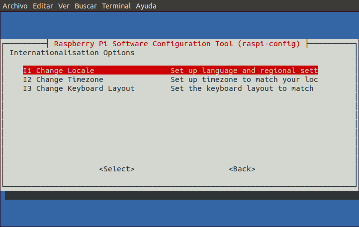

*Configuración del idioma y de los ajustes locales (“Change Locale”)*
Con esta opción podemos instalar fácilmente las configuraciones de idioma que deseemos. Para no demorar en exceso el proceso, conviene instalar únicamente aquellas configuraciones regionales que nos sean útiles.

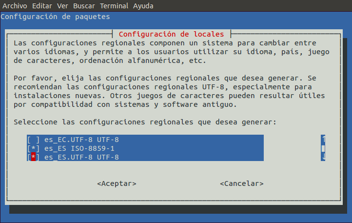

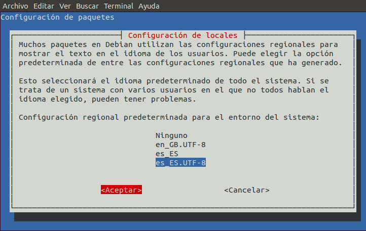

*Configuración de la zona horaria (“Change Timezone”)*
En este menú deberemos seleccionar aquella localización que se ajuste a nuestra zona horaria.

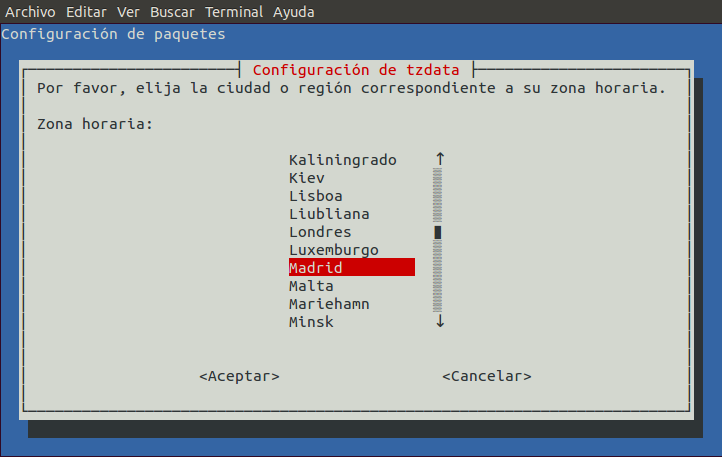

*Configuración del teclado (“Change Keyboard Layout”)*
En este punto intentaremos llevar a cabo una configuración lo más ajustada posible a nuestro teclado.

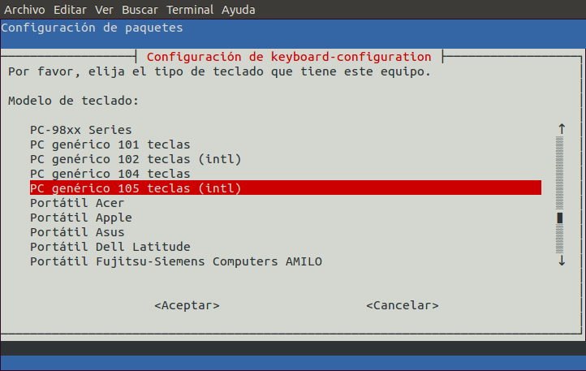

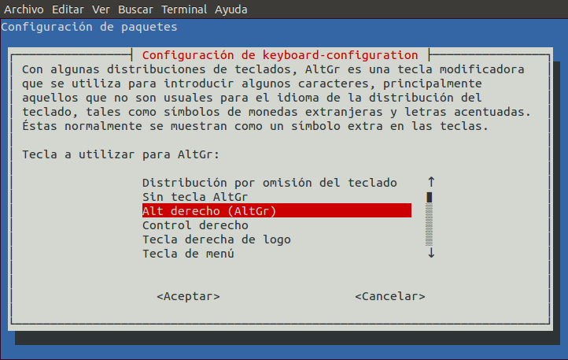

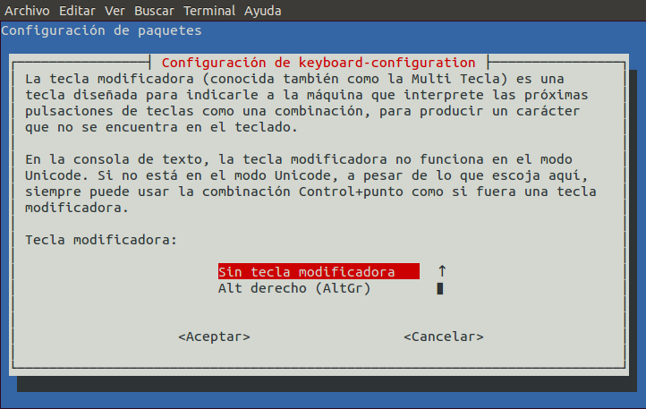

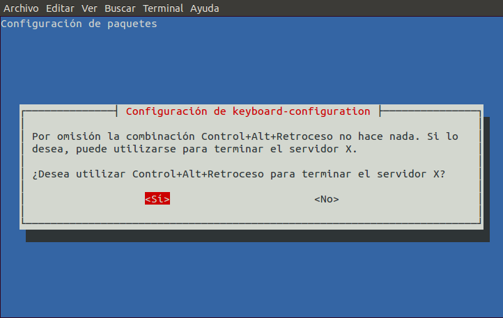

**e) Configuración del Overclocking (“Overclock”)**
En el mismo menú de `raspi-config` aparece la posibilidad de configurar la frecuencia máxima del procesador. Aunque el procesador de una Raspberry Pi trabaja por defecto a una frecuencia máxima de 700 MHz, es posible elevar la misma hasta los 1000 MHz.
Esta es una opción que conviene ir configurando progresivamente, comprobando el rendimiento de nuestra Raspberry Pi funcionando a diferentes frecuencias.

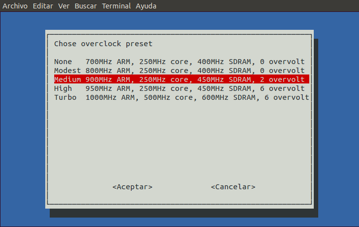

**f) Opciones Avanzadas (“Advanced Options”)**
En el submenú de opciones avanzadas, podemos configurar otros parámetros adicionales del sistema como la apariencia de la interfaz gráfica en algunos monitores (“Overscan”), el nombre de la máquina ("Hostname"), la posibilidad de habilitar/deshabilitar las conexiones SSH como usuario `root` o la configuración de la salida de audio, entre otras.

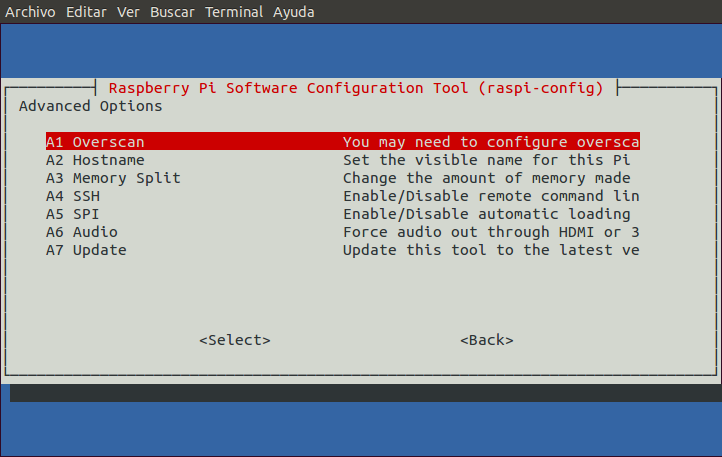

### Requisitos adicionales de nuestra instalación
Para usar una Raspberry Pi con Raspbian como un *thin client* capaz de conectarse a nuestros servidores de máquinas virtuales de OpenStack es necesario instalar los siguientes paquetes adicionales:
1. Cliente de escritorio remoto `freerdp`. Necesario para visualizar los escritorios de las instancias a las que nos conectamos a través del broker VDI.
Basta con instalar el paquete `freerdp-x11`:
	
	# apt-get install freerdp-x11

2. *Plugin* para proporcionar soporte a aplicaciones web Java. Necesario para ejecutar el *applet* Java para conectarnos a las instancias de OpenStack desde el broker VDI.
Basta con instalar el paquete `icedtea-7-plugin` que ya incluye como dependencia el paquete `openjdk-7-jre`:

		# apt-get install icedtea-7-plugin

3. Navegador con capacidad para ejecutar aplicaciones Java:

* Midori (instalado por defecto en Raspbian).
* Chromium (`# apt-get install chromium-browser chromium-browser-l10n`)
* Iceweasel (`# apt-get install iceweasel`)