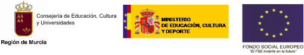

# Documentación 

En este repositorio se encuentra toda la documentación y software realizados en el proyecto de innovación __OpenMurVDI: despliegue de una infraestructura de clientes ligeros orientados a Cloud-Computing__, en el IES Ingeniero de la Cierva durante el curso 2013-2014.

Este proyecto, finalizado en mayo de 2014, implementa una infraestructura de virtualización de escritorios, para utilizar con clientes ligeros (Thin Clients, Raspberry Pi, PCs reutilizados), basada en OpenStack y componentes abiertos y libres.

Para su mayor difusión y reutilización se libera:

+ toda la documentación bajo licencias Creative Commons.
+ todo el software bajo licencia libre GPL.

Aquí se puede encontrar todas las producciones del proyecto inicial. 

Proyecto cofinanciado:

Pero, debido al gran interés suscitado al finalizar el proyecto y para mantener vivos los trabajos realizados, se plantea una línea de continuidad para crear nuevas versiones, modificaciones y documentaciones posteriores. Todas las producciones que se pudieran realizar con posterioridad se podrán encontrar también de forma libre en https://github.com/StackVDI

__This project has been discontinued, please go to the new repo https://github.com/StackVDI or http://www.stackvdi.com__
